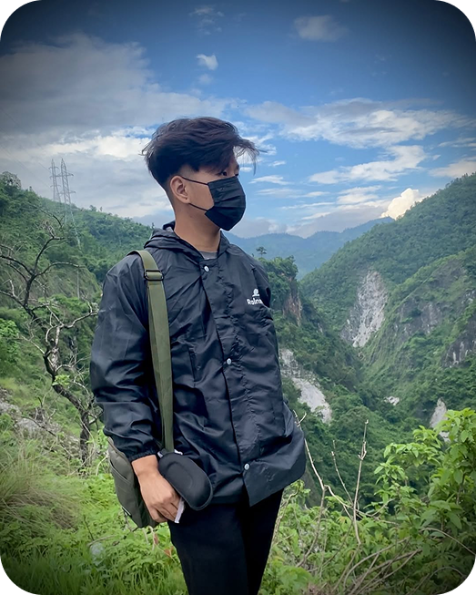
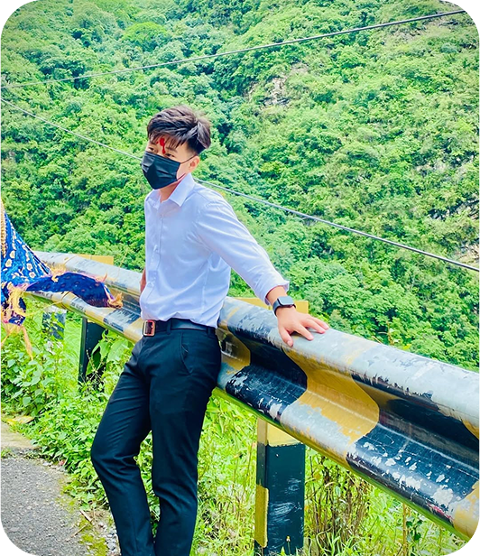

# Hi there! 👋

  I'm <strong>Sijan</strong>, a developer from Nepal, enthusiastic about nix, golang & JS/TS and many more. ☁️ 
   I enjoy the challenge of reimagining existing apps & scripts in my own unique way.
   By creating these projects from scratch, I can ensure complete control over every aspect of their design and functionality.

  
  
  

  

